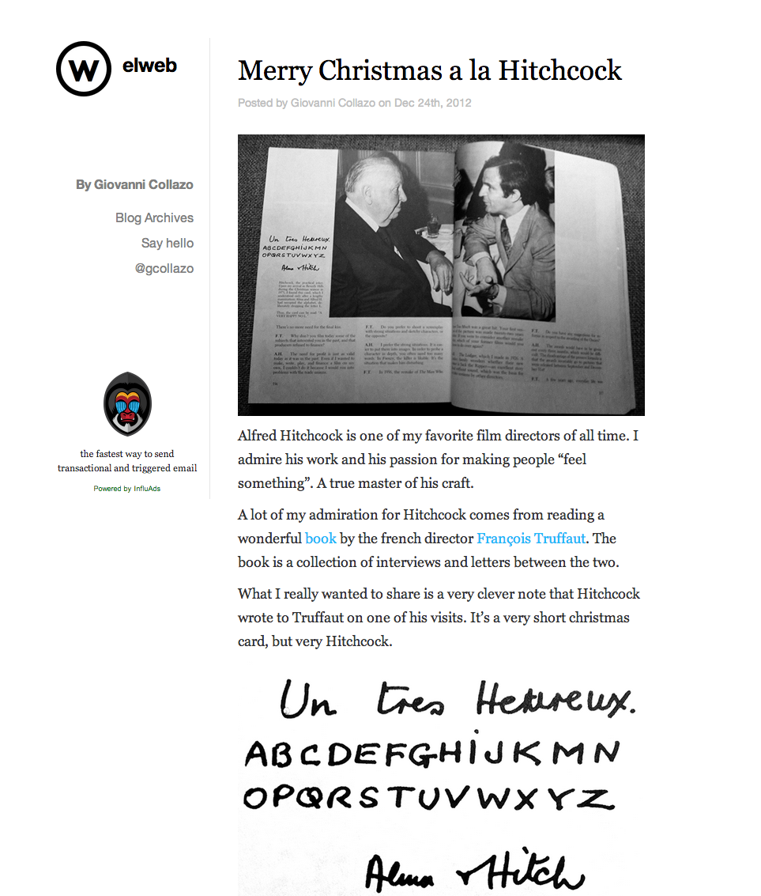

# elweb3

A miminalist blog theme for WordPress designed for [elweb.co](http://elweb.co). Works on desktops, tablets and mobile.

## Screenshot

## Installation
- Download the [latest release](https://github.com/gcollazo/elweb3/releases).
- Un-zip and copy to your `wp-content/themes/` folder.
- Edit the file `config.php`.
- Create the required menus via the WordPress admin.
    - Appearance > Menu
    - Create and assign menus for **Sidebar**, **Footer** and **Mobile**.
- Go write awesome blog posts.

## Built using
- [Bootstrap 3](http://getbootstrap.com/) - CSS Framework
- [Brunch](http://brunch.io) - Build tool
- [Stylus](http://learnboost.github.io/stylus/) - CSS Pre-processor

## License

All of elweb3 is licensed under the MIT license.

Copyright (c) 2013 Giovanni Collazo

Permission is hereby granted, free of charge, to any person obtaining a copy of
this software and associated documentation files (the "Software"), to deal in
the Software without restriction, including without limitation the rights to
use, copy, modify, merge, publish, distribute, sublicense, and/or sell copies
of the Software, and to permit persons to whom the Software is furnished to do
so, subject to the following conditions:

The above copyright notice and this permission notice shall be included in all
copies or substantial portions of the Software.

THE SOFTWARE IS PROVIDED "AS IS", WITHOUT WARRANTY OF ANY KIND, EXPRESS OR
IMPLIED, INCLUDING BUT NOT LIMITED TO THE WARRANTIES OF MERCHANTABILITY,
FITNESS FOR A PARTICULAR PURPOSE AND NONINFRINGEMENT. IN NO EVENT SHALL THE
AUTHORS OR COPYRIGHT HOLDERS BE LIABLE FOR ANY CLAIM, DAMAGES OR OTHER
LIABILITY, WHETHER IN AN ACTION OF CONTRACT, TORT OR OTHERWISE, ARISING FROM,
OUT OF OR IN CONNECTION WITH THE SOFTWARE OR THE USE OR OTHER DEALINGS IN THE
SOFTWARE.